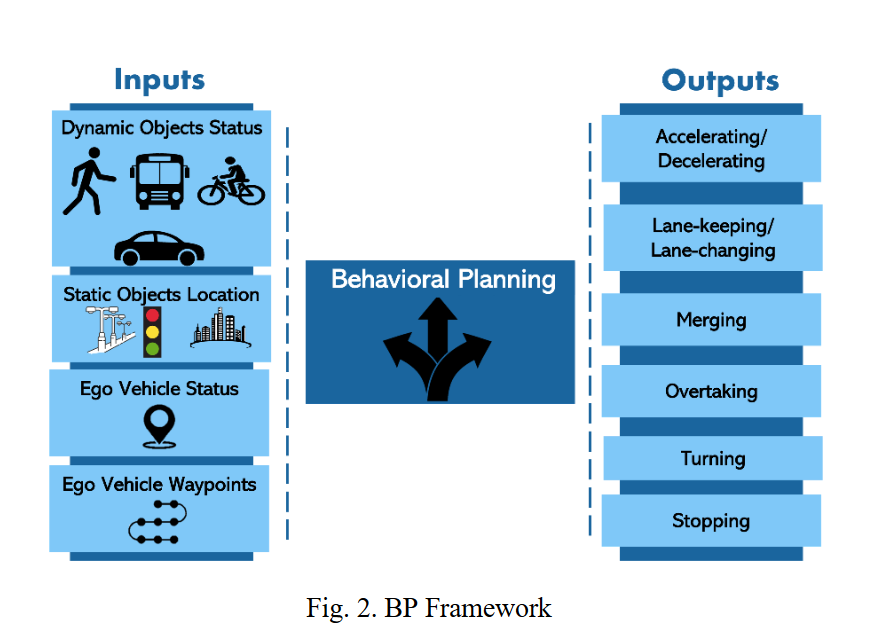
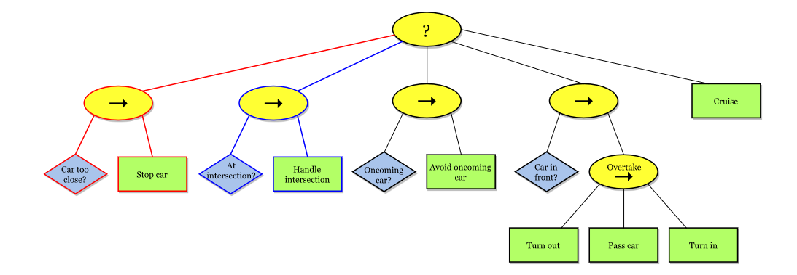
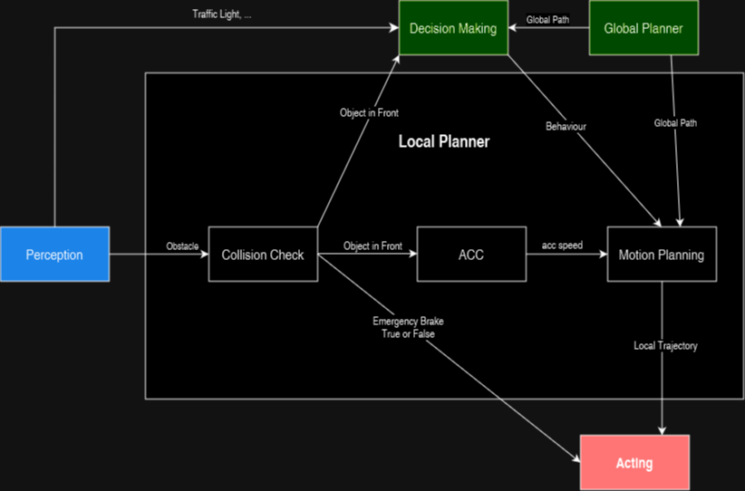
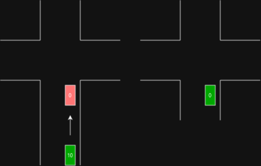
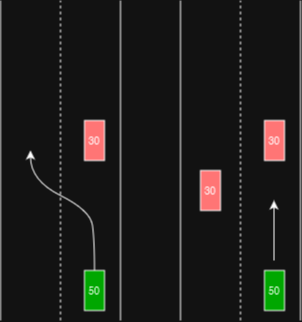

# Local Planning for first milestone

**Summary:** This document states the implementation plan for the local planning.

- [Local Planning for first milestone](#local-planning-for-first-milestone)
  - [Research](#research)
  - [New Architecture for first milestone](#new-architecture-for-first-milestone)

## Research

Paper: [Behavior Planning for Autonomous Driving: Methodologies, Applications, and Future Orientation](https://www.researchgate.net/publication/369181112_Behavior_Planning_for_Autonomous_Driving_Methodologies_Applications_and_Future_Orientation)

Rule-based planning

Advantages:

- Simple implementation.
- Low computational
power.
- Real-time operation.
- Adapt the rationality of
human thinking.
- Its behavior can be easily
traced and explained

Disadvantages:

- Inability to handle
complex environments.
- Risk of rules explosion.
- Inability to handle
uncertainty.
- Low ability to handle
unplanned situations

Paper: [A Rule-Based Behaviour Planner for Autonomous Driving , pp 263 -279](https://link.springer.com/chapter/10.1007/978-3-031-21541-4_17)

- Two-layer rule-based theory
- Behaviours: Emergency-Stop, Stop, Yield, Decelerate-To-Halt, Pass-Obstacle, Follow-
Leader, Track-Speed

Github: [Decision Making with Behaviour Tree](https://github.com/kirilcvetkov92/Path-planning?source=post_page-----8db1575fec2c--------------------------------)

- No Intersection
- Collision Detection in behaviour Tree

Paper: [Behavior Trees for
decision-making in Autonomous
Driving](https://www.diva-portal.org/smash/get/diva2:907048/FULLTEXT01.pdf)

- simple simulation
- Car only drives straight

## New Architecture for first milestone

- Keeping it simple
- Iterative Progress
- Divide decisions into high level and low level to keep behaviour tree small.

High Level Decisions:

- Intersection
- Lane Change
- Cruise (NoOp)
- (Overtake - limit for multilane)

Low Level Decision:

- Emergency Brake
- ACC

Scenarios:

Left: Behaviour Intersection is triggered for motion planning, acc publishes speed. -> Lower speed is used to approach intersection

Right: Behaviour Intersection is used for motion planning, acc is ignored (no object in front)

Left: Overtake gets triggered to maintain speed, acc is ignored

Right: Overtake not possible, acc reduces speed to avoid collision

What needs to be done:

- Implement ACC
- Implement motion planning
- Change publishers in behaviours (only publish name of task)
