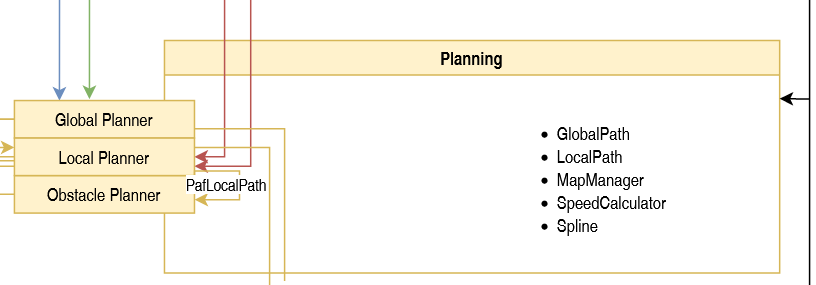
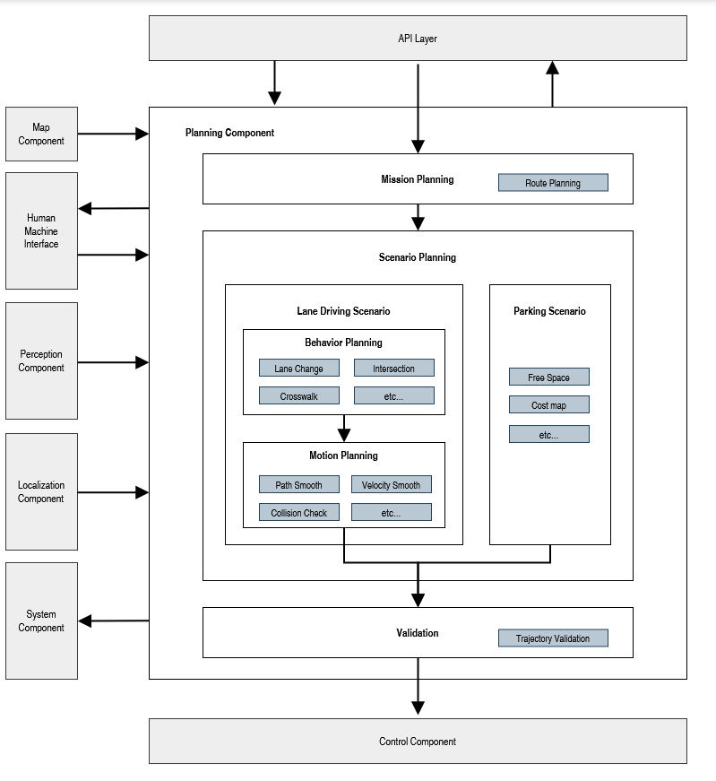

# Planning

**Summary:** This page contains research into the planning component of the PAF21_2 group.

- [Planning](#planning)
  - [What is Planning?](#what-is-planning)
    - [PAF21 - 2](#paf21---2)
    - [Autoware](#autoware)
  - [Resumee](#resumee)
    - [Notes](#notes)

## What is Planning?

Finding the optimal path from start to goal, taking into account the static and dynamic conditions and transfering a suitable trajectory to the acting system

### [PAF21 - 2](https://github.com/ll7/paf21-2)

Input:

- Perception (Obstacle list, traffic lights) (red)
- Map (CR Scenario) (green)
- Competition Manager (Routing request) (blue)
- Carla (Odometry) (black)

Output:

- Acting (Local path, obstacle follow info)
- Validation (Route, path, speed)

Components:

Global Planner

- Calculates the shortest route between start and destination.
- Uses the [CommonRoad Route Planner](https://commonroad.in.tum.de/tools/route-planner)
- Returns a route matrix with all lane information.

Local Planner

- Optimise a segment of the global path
- Observe traffic regulations properly
- React appropriately to road users and obstacles
- Uses the Obstacle Planner to decide on acting instructions (desired speed, lane change)

Obstacle Planner

- Detection and prediction of dynamic obstacles using the Semantic Lidar
- Reject obstacles that do not cross the path
- Obstacle with the shortest distance is passed on

Speed Calculator

- Processes speed information
- Calculates Cornering speed and deceleration for braking

Map Manager

- Manages static map data
- Can be used for debugging

[Cubic Spline Planer](https://github.com/AtsushiSakai/PythonRobotics/blob/master/PathPlanning/CubicSpline/cubic_spline_planner.py)

### [Autoware](https://github.com/autowarefoundation/autoware)

Input:

- Map Data (static informations)
- Perception (dynamic informations)
- Localization (position, velocity, acceleration)
- API Layer (Goal, Checkpoint)
- HMI (driving operations by human operator)
- System (operation mode)

Output:

- Control (Trajectory 10s with 0.1s Resolution)
- System (Diagnostics)
- HMI (Availability of operations)
- API Layer (Information about the reasoning behind behaviour)

Modules:

Mission Planning: Calculates a route based on goal and map information

Scenario Planning: Determines Trajectory based on scenario (Lane Driving or Parking)

Lane Driving: Trajectory for driving within constructed lanes.

- Behavior Planner: Calculates path based on safety considerations and traffic rules.
- Motion Planner: Safety Factors, Vehicle Motion and behavior planner -> trajectory

Parking: Trajectory for Parking

Validation: Verifies the safety of the trajectory

Internal Modules:

Behaviour Planning

- Lane Change
- Lane Following
- Intersection
- Traffic Light
- Crosswalk

Motion Planning

- Path Smooth
- Velocity Smooth
- Collision Check

## Resumee

### Notes

- Modular architecture seems best
- Discrete Actions for behaviour
- Data Flow: Perception -> Local Path -> Trajectory -> Action
- Global Path if needed
- Interfaces to Perception and Acting must be well defined.
- Logging of decisions for debugging
